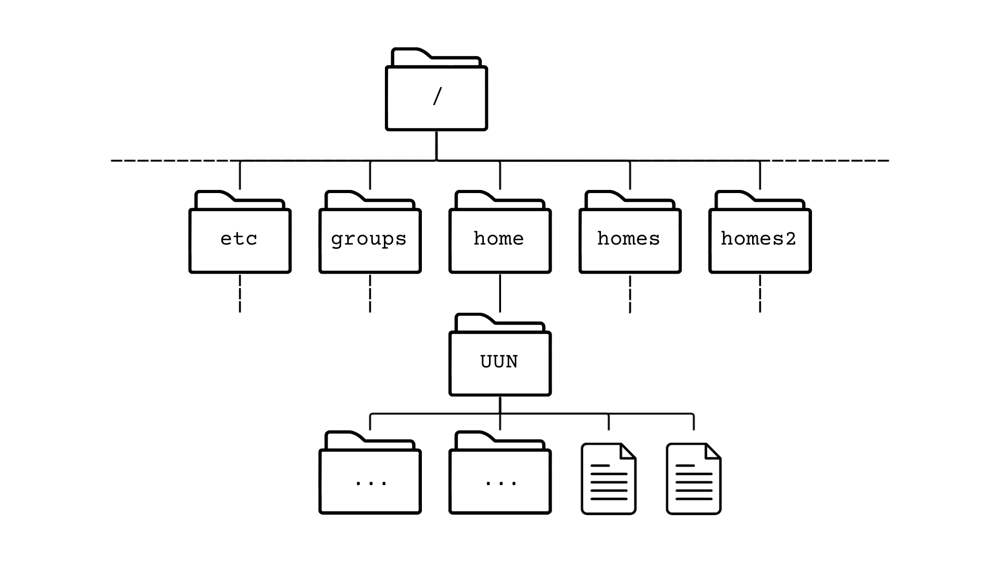

```{=html}
<script src="https://kit.fontawesome.com/ece750edd7.js" crossorigin="anonymous"></script>
```

## System structure

Before we get to work with Linux, it is good to know how the system is structured. Files on Linux are grouped into **directories** (also called folders, similar to Windows and Mac). The directories are structured in a tree structure. This means directories are within other directories, creating a complex hierarchical tree like structure. At the base of it all is the **root directory**, which is indicated with "/". This directory holds everything. It can contain **files** and **subdirectories**. Each subdirectory in turn can contain other files and subdirectories, and those can contain files and subdirectories, and so on. \
An example of the file system is shown below.

User directories are usually stored in the `/home` directory and named after each user. UUN in the figure below should be replaced with your own UUN to find your own home directory.

{fig-align="center"}

It is vital to understand that you always work within a specific directory and any commands you run will be run in the context of that specific directory.

There are a few special characters, when working within the file system, that refer to specific folders. The table below gives an overview of the special characters that can be used to browse the tree.

| Character | Meaning |
|------|------|
|   /   |   root directory   |
|   ~   |   home directory   |
|   .   |   current directory   |
|   ..   |  parent directory    |


With the knowledge of what the tree looks like and the use of special characters, we should be able to find our files. To identify any file or directory we need to determine its **path**. The path is the route to the file or directory starting from a directory. Paths are written as the list of directory names separated by a forward slash.

For example `/home/johndoe/mouse_genome.fa` links to a file named mouse_genome in the home folder belonging to johndoe. When referring to files starting from the root directory, we call these paths **absolute paths**. This means that no matter where you are in the filesystem, the path will always refer to the same file.

We can also use **relative paths**, which are paths that start from the current working directory. For example, if we are currently in the home directory of user johndoe, we can refer to the same file simply as `mouse_genome.fa`. Relative paths are generally shorter and easier to type, but they are dependent on the current working directory.

A user logged in as janedoe would have a different home directory under `/home/janedoe`, and the relative path `mouse_genome.fa` would only work if they also had a file named mouse_genome.fa in their home directory. Still, they would be working with a different file from johndoe. To access the same file as johndoe, janedoe would need to use the absolute path `/home/johndoe/mouse_genome.fa`, or a relative path `../johndoe/mouse_genome.fa`.

If you are ever in doubt, use the absolute path (start the path from the root).

::: key-points
<h2><i class="fas fa-thumbtack"></i> Key points</h2>

There are several best practices for choosing good file and directory names. 

1.  Everthing in Linux is **case sensitive**. If in doubt, stick to **lower case**. 
\
The filename `myfile` is **not** the same as `MyFile`, `Myfile`, or `myFile`. This is also the case for any commands we work with. 
2. File and directory names should **only contain letters, numbers, hyphens, underscores** and **full stops**
3. File and directory names should **not contain any spaces**

In contrast to graphical environments, the command line interface can become cumbersome whenever our file or directory names contain spaces or special characters. For example, the shell will consider `my file` to be two files, i.e. "my" and "file". If you have files containing spaces or special characters and you want to use them within Linux, you will need to enclose the full filename in quotation marks or you will need to escape spaces and special characters with a backslash. This makes sure that the shell understands it is part of the filename:
`"my file"` or `my\ file`

To make our life easier, it is best to avoid spaces and unusual characters all together. 
:::

Whenever we first start a shell on a Linux system, your **working** or **current directory** will be your **home directory**. On most Linux systems your home directory will be called /home/username.

Unless we reference the path, Linux will look for a file in the current working directory. If we ever want to check what the current working directory is, we can use the command `pwd` which stands for present working directory.

``` bash
pwd
```

:::: challenge
<h2><i class="fas fa-pencil-alt"></i> Challenge 1:</h2>

What is your current working directory?

<details>

<summary>Solution</summary>

::: solution
<h2><i class="far fa-eye"></i> Solution:</h2>

Run `pwd`, and look at which directory you are in. Check if your username is your UUN.
:::

</details>
::::

## Files and Folders

We are going to play with files and directories and take a look at how to browse them and refer to them. To look at which files and subdirectories we have within our folder, we can use the `ls` (list) command.

``` bash
ls
```

It might be that there are currently no files within your directory. Just to have some files to play with, we will copy them from a central location on the DRP-HCB Bioinformatics server. For this we will use the `cp` (copy) command. 

``` bash
cp -r /library/training/Intro_to_Linux ./
```

**NOTE:** if you are working from your own server or system, download the data as followed and unpack it. You do NOT need to run the following if you are working on the DRP-HCB Bioinformatics server. Don't worry about the messages you get on screen, we will talk about these later on.

``` bash
wget https://github.com/DRP-HCB-Bioinformatics/Bioinformatics_on_the_Linux_command_line/raw/refs/heads/main/Intro_to_Linux.tar.gz
tar -xzvf Intro_to_Linux.tar.gz
```

If we take a look again at what is in our folders, we will now see that a folder has been added called Intro_to_Linux. 

``` bash
ls
```

If we want to know what is inside the folder, we can use `ls` again and use an ***argument*** to specify the folder that we want to explore.

``` bash
ls Intro_to_Linux
```

The folder is in our home directory, which means the `ls` command has run in the current location. We can use absolute paths as well. \
*Replace \<UUN\> by your own UUN or username.*

``` bash
ls /home/<UUN>/Intro_to_Linux
```

We can also use the `~` shortcut to reference our home directory. 

``` bash
ls ~/Intro_to_Linux
```

The last 3 commands all have the same results, which should show us the content of the folder Intro_to_Linux. 

As mentioned before, Linux has difficulties with spaces in names. There is one directory in our Intro_to_Linux directory that contains spaces. When Linux reports files or directories that contain special characters, it will put quotes around the name to indicate there is something about the name which is outside the general rules. Before we get into how to deal with files and directories with spaces, lets look at how to navigate the system. 

## Navigaton

We aren't limited to staying and working in one directory. To move between directories, use the `cd` (change directory) command and add the folder that you want to navigate to as an ***argument***.

``` bash
cd Intro_to_Linux
```

If you take a look at the actual prompt, this has now changed to reflect your current location:

`<UUN>@bifx-core1:~$` to `<UUN>@bifx-core1:~/Intro_to_Linux$`

:::: challenge
<h2><i class="fas fa-pencil-alt"></i> Challenge 2:</h2>

Navigate back to the parent directory of this folder. Confirm the folder you are in is your home folder.

<details>

<summary>Solution</summary>

::: solution
<h2><i class="far fa-eye"></i> Solution:</h2>

Remember the different special character meanings in the table above. Using `..` we can navigate to the parent directory. We can use `pwd` to check which folder we are currently in.

``` bash
cd ..
pwd
```

If you used a different method to get back to your home folder, that is amazing, there are multiple ways to get back to your home folder e.g.

``` bash
cd ~
```
``` bash
cd /home/UUN
```

:::

</details>
::::

Using `..` we can go to the parent directory of the current directory. We can use this multiple times to go up several levels.

``` bash
cd ../..
pwd
```

Notice that when we ask for the `pwd` we just get a `/`. This means we are now be in the root directory and have therefore gone up two levels.

:::: challenge
<h2><i class="fas fa-pencil-alt"></i> Challenge 3:</h2>

Navigate back to the Intro_to_Linux folder.

<details>

<summary>Solution</summary>

::: solution
<h2><i class="far fa-eye"></i> Solution:</h2>

Looking at the `ls` commands above we showed 3 different ways to get to the folder. Use any of these to get back to your home. 

``` bash
cd ~/Intro_to_Linux
```
:::

</details>
::::

:::: challenge
<h2><i class="fas fa-pencil-alt"></i> Challenge 4:</h2>

Navigate into the Intro_to_Linux/genomes/human folder.

<details>

<summary>Solution</summary>

::: solution
<h2><i class="far fa-eye"></i> Solution:</h2>

From where we are currently, we don't have to use the full path, we can use a relative path. 

``` bash
cd genomes/human
```
:::

</details>
::::

Because we are already in the Intro_to_Linux folder, we can create a relative path from our current folder into the folder we actually want to be in. It is important to remember that relative paths change whenever our current working directory changes. Absolute paths will always be the same. But what happens if we try to navigate to a folder that exists but is not in the current directory?

``` bash
cd mouse
```

The computer tells us that the directory does not exists. 

:::: challenge
<h2><i class="fas fa-pencil-alt"></i> Challenge 5:</h2>

Navigate to the Intro_to_Linux/genomes/mouse folder using a relative path.

<details>
<summary>Solution</summary>
::: solution
<h2><i class="far fa-eye"></i> Solution:</h2>

If we want to navigate to the mouse folder using a relative path from our current working directory, we need to know where we are (we can always double check this is `pwd`). Knowing that we are in the Intro_to_Linux/genomes/human folder and wanting to go to the Intro_to_Linux/genomes/mouse folder, we can use the `..` character to go up a level.

``` bash
cd ../mouse
```
:::
</details>
::::

We know how to navigate normal directories, but what about the strange one we saw previously with the spaces in it. Lets go back to the Intro_to_Linux folder first. 

``` bash
cd ~/Intro_to_Linux
```

Within this folder there is a folder named "dir with spaces". If we want to know what is inside this folder, we would use the `ls` command with the name of the folder behind it. What happens if we do just that?

``` bash
ls dir with spaces
```

Basically, Linux thinks we want to know what is inside 3 different folders: dir, with, and spaces. None of these exist and so we get errors. When using `ls`, Linux puts quotes around the name when it reports it to us, if we want to ask what is inside we can use the same system.

``` bash
ls 'dir with spaces'
```

:::: challenge
<h2><i class="fas fa-pencil-alt"></i> Challenge 6:</h2>

What happens if we try to use `Tab` completion?

<details>
<summary>Solution</summary>
::: solution
<h2><i class="far fa-eye"></i> Solution:</h2>

Type the first part of the folder name "dir" and press `Tab`. The following should show up. 

``` bash
ls dir\ with\ spaces/
```
:::
</details>
::::

To complete the command, Linux puts a `\` before the spaces. This is known as escaping characters. When we put a `\` before a special character, we tell the computer to disregard its normal meaning. We can also use that in full paths.

``` bash
ls ~/Intro_to_Linux/dir\ with\ spaces
```

It's not the nicest, but it does mean we can look at files that have special characters without having to rename them before working with them. 

## Exercises

Below are a number of exercises designed to explore the filesystem. 

:::: exercise
<h2><i class="fa fa-pencil-alt"></i> Exercise 1:</h2>

Navigate back to your home directory. 
List the contents of the Intro_to_Linux directory without moving into it.

<details>
<summary>Solution</summary>
::: solution
<h2><i class="far fa-eye"></i> Solution:</h2>

We do not have to move folders to be able to see the content of a folder. Using `ls` we can specify the folder we want to look at. 
``` bash
cd ~

ls Intro_to_Linux
```
:::
</details>
::::

:::: exercise
<h2><i class="fa fa-pencil-alt"></i> Exercise 2:</h2>

Navigate to the Intro_to_Linux directory. \
List the contents of your home folder without moving directory. 

<details>
<summary>Solution</summary>
::: solution
<h2><i class="far fa-eye"></i> Solution:</h2>

We do not have to move folders to be able to see the content of a folder. Using `ls` we can specify which folder we want to look at. 

``` bash
cd Intro_to_Linux

ls ../
```
:::
</details>
::::

:::: exercise
<h2><i class="fa fa-pencil-alt"></i> Exercise 3:</h2>

Using `--help`, learn how the options `-a` and `-l` affect the `ls` command. 

<details>
<summary>Solution</summary>
::: solution
<h2><i class="far fa-eye"></i> Solution:</h2>

Run `ls` with the `--help` option. Take a look at `-a`.

``` bash
ls --help
```

If we use the `-a` option when running `ls`, we do not ignore entries starting with `.`. \
A good folder to try this on is the home folder. 

``` bash
ls ~

ls -a ~
```

Do you see the differences in files reported? Files beginning with `.` are known as hidden files. These are generally configuration files or files used by the operating system.

If we use the `-l` option when running `ls`, the output is in long mode. This gives extra information about files and folders, like their size, access permissions and when they were last modified.

``` bash
ls -l ~
```

:::
</details>
::::

:::: exercise
<h2><i class="fa fa-pencil-alt"></i> Exercise 4:</h2>

List the contents of the genomes folder within the Intro_to_Linux folder using its **absolute** path. 

<details>
<summary>Solution</summary>
::: solution
<h2><i class="far fa-eye"></i> Solution:</h2>

Remember that the absolute path starts from the root `/`\
Replace the <UUN> with your UUN.

``` bash
ls /home/<UUN>/Intro_to_Linux/genomes
```
:::
</details>
::::

:::: exercise
<h2><i class="fa fa-pencil-alt"></i> Exercise 5:</h2>

Write the **relative** path in two different ways from you current location for the genomes folder within the Intro_to_Linux folder.

<details>
<summary>Solution</summary>
::: solution
<h2><i class="far fa-eye"></i> Solution:</h2>

Because we should currently be in the Intro_to_Linux folder, the following should work.

``` bash
ls ~/Intro_to_Linux/genomes

ls genomes
```
:::
</details>
::::